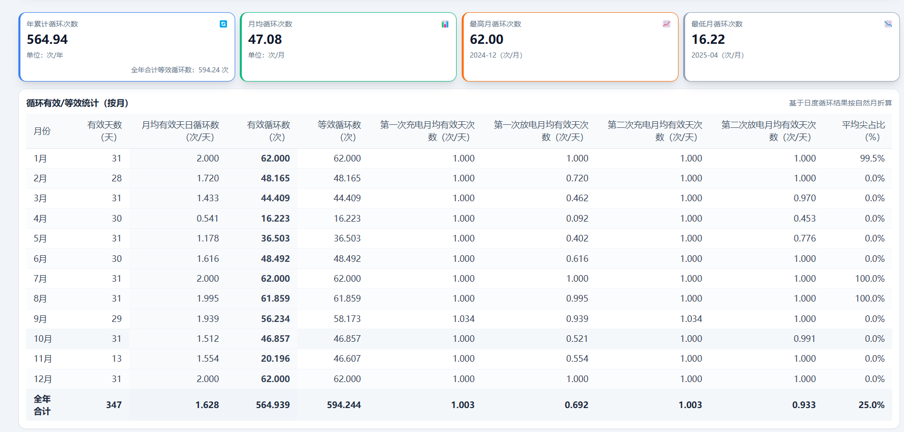
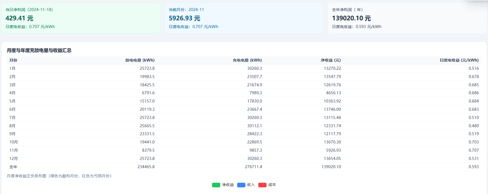
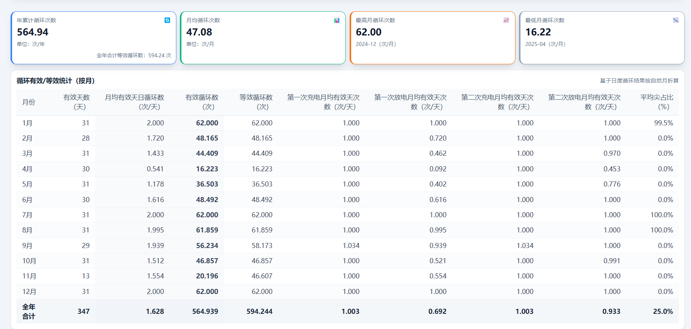
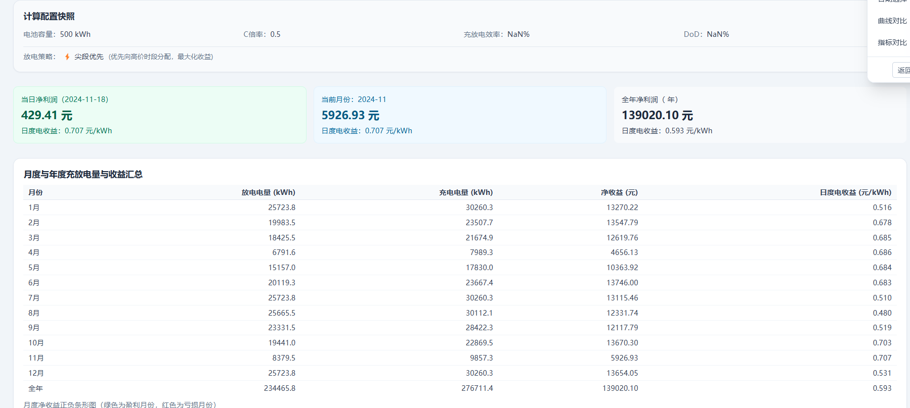

# Changelog

All notable changes to this project will be documented in this file.

The format is based on [Keep a Changelog](https://keepachangelog.com/en/1.0.0/),
and this project adheres to [Semantic Versioning](https://semver.org/spec/v2.0.0.html).

## [1.2.0] - 2025-12-06

### Added
- **尖段优先放电策略** - 在储能收益计算中新增"尖段优先"放电策略选项
  - 用户可在 StorageCyclesPage 中选择放电策略（时序放电 vs 尖段优先）
  - 尖段优先策略通过按电价降序分配能量，预期提升收益 5-15%
  - 遵守变压器功率限制和电池C倍率约束
  - 按日期分组进行能量分配，避免跨日能量累积
- **配置快照显示** - StorageProfitPage 新增配置快照区域
  - 显示电池容量、C倍率、效率、DoD 等关键参数
  - 显示当前使用的放电策略（图标+名称+描述）
- **单元测试套件** - 新增 `backend/tests/test_cycles_price_priority.py`
  - 5个核心测试用例覆盖基础排序、功率约束、边界场景
  - 1个综合测试用例验证实际放电窗口混合场景
- **⚖️ 策略对比分析工具** - 新增 StorageStrategyComparisonPage 页面
  - 并排展示时序放电与尖段优先两种策略的收益差异
  - 年度汇总对比：净利润、放电收入、充电成本、放电量等指标
  - 月度详细对比：逐月展示差值和提升幅度
  - 诊断提示：当策略差异极小时提供原因分析和配置建议
- **详细调试日志** - 后端添加完整的策略执行日志
  - 打印放电窗口点数、价格范围、能量分配过程
  - 对比两种策略的分配结果，便于验证和调试
- **测试数据生成器** - 新增 `generate_test_data.py` 工具
  - 生成包含明显价格差异的全年负荷数据
  - 提供推荐的分时电价配置指南
  - 帮助用户验证策略效果

### Changed
- **后端 API** - `/api/storage/cycles` 端点接受新参数 `discharge_strategy`
  - 默认值为 `"sequential"` 保持向后兼容
  - 可选值：`"sequential"` | `"price-priority"`
- **核心算法** - `compute_profit_summary_step15()` 函数支持策略切换
  - 新增 `_allocate_discharge_by_price()` 辅助函数实现价格优先分配
  - 保持原有时序分配逻辑不变（默认行为）

### Technical Details
- 后端新增函数：`backend/services/cycles.py::_allocate_discharge_by_price()` (lines 1571-1640)
- 前端新增类型：`types.ts::DischargeStrategy` (line 352)
- 前端新增常量：`constants.ts::DISCHARGE_STRATEGY_INFO` (lines 105-118)
- UI 组件更新：`StorageCyclesPage.tsx` 新增策略选择器 (lines 2695-2741)
- UI 组件更新：`StorageProfitPage.tsx` 新增配置快照区域

### Documentation
- 更新 `README.md` 功能特性部分，添加放电策略说明
- 更新 `.github/copilot-instructions.md` Profit Calculation 部分
- 新增 `docs/尖段优先放电策略_PRD.md` 产品需求文档
- 新增 `docs/尖段优先放电策略_开发计划.md` 开发计划文档

---

## [1.1.0] - 2024-XX-XX

### Added
- 初始版本功能
  - 负荷数据上传、清洗、质量分析
  - 分时电价（TOU）配置与日期规则管理
  - 储能充放电次数与收益计算
  - 储能经济性测算（IRR、NPV、投资回收期）
  - 项目评估报告生成（AI 驱动）

---

## [Unreleased]

### Planned
- [ ] 历史数据重新测算支持（策略切换后批量更新）
- [ ] 放电策略对比分析工具（并排展示两种策略收益差异）
- [ ] Excel 导出增强（包含策略标识与对比表）
- [ ] 性能优化（大规模数据集价格排序加速）

---
## 测试
### 时序放电测试结果

### 尖段优先放电测试结果

