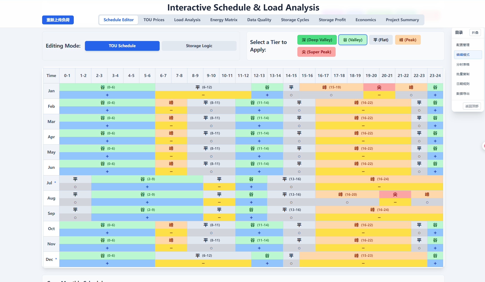
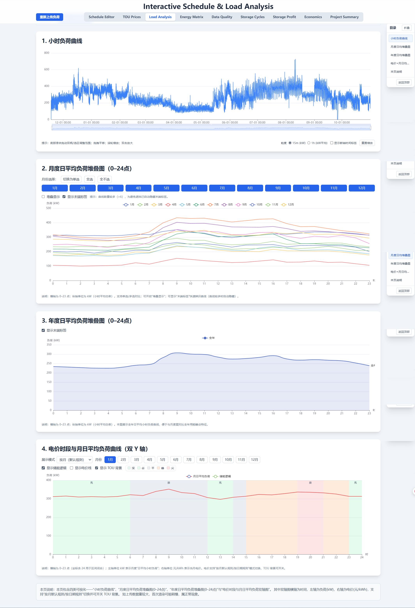
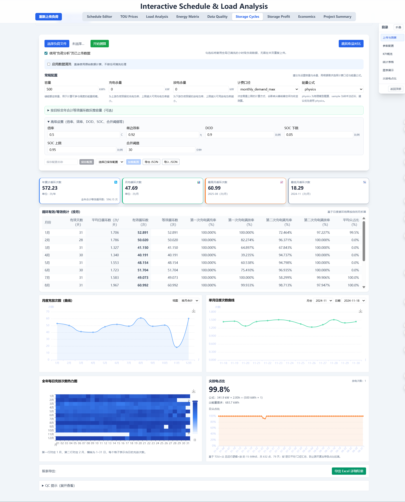
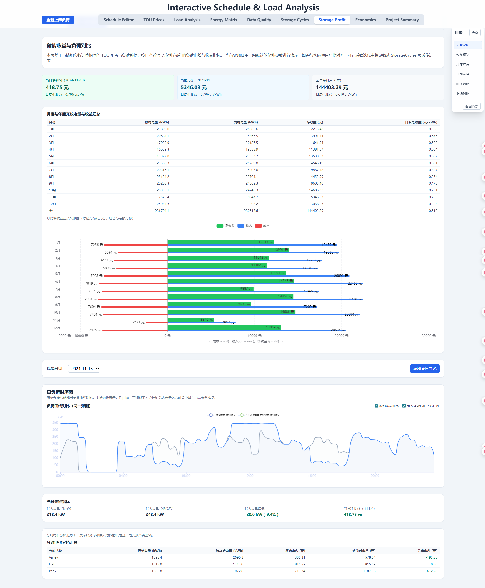
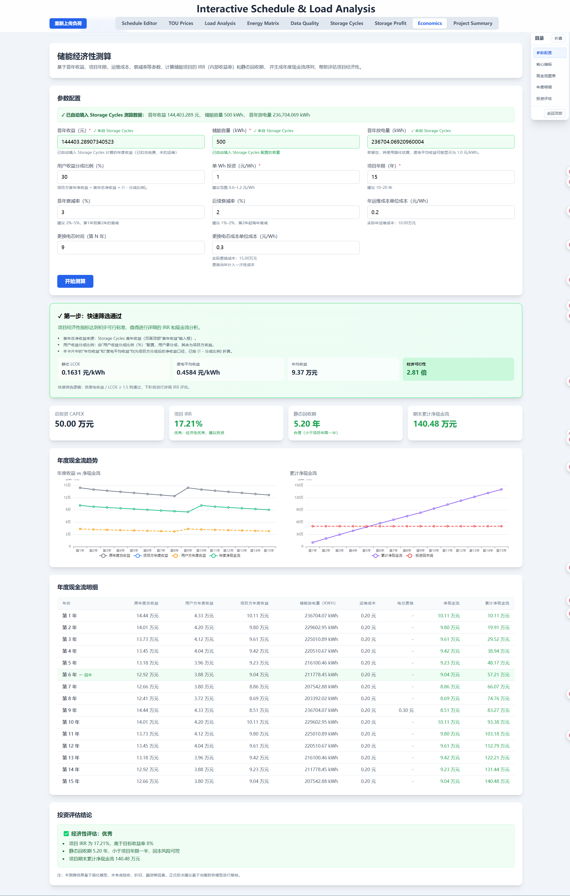

<div align="center">

# ⚡ 负荷数据分析与储能测算系统

**Load Analysis & Energy Storage Sizing Platform**

[](https://www.python.org/)
[](https://www.typescriptlang.org/)
[](https://fastapi.tiangolo.com/)
[](https://reactjs.org/)
[](LICENSE)

一个专业的电力负荷数据可视化分析与储能系统定容测算平台

[功能特性](#-功能特性) • [快速开始](#-快速开始) • [界面预览](#-界面预览) • [项目结构](#-项目结构) • [API 文档](#-api-文档) • [开发指南](#-开发指南)

</div>

---

## 📋 项目简介

本系统是一个集成化的电力负荷分析与储能测算平台，专为电力规划、能源管理和储能项目设计人员开发。通过智能化的数据处理和可视化技术，帮助用户快速完成负荷特性分析和储能系统容量配置。

### 🎯 核心功能

- 📊 **负荷数据可视化** - 多维度展示负荷曲线、峰谷特性、负荷率等关键指标
- 🔋 **储能定容测算** - 基于负荷数据自动计算储能容量、充放电次数、经济效益
- 💰 **电价管理** - 灵活配置分时电价、峰谷平时段，支持多种电价策略
- 📈 **数据清洗分析** - 自动识别异常数据、缺失值处理、数据质量评估
- 📄 **报告生成** - 支持导出 Excel 报表，并可通过浏览器导出/打印 PDF 报告

---

## 🚀 快速开始

### 环境要求

| 组件 | 版本要求 |
|------|---------|
| Node.js | 16.0+ |
| Python | 3.8+ |
| npm | 8.0+ |
| pip | 21.0+ |

### 安装步骤

#### 1️⃣ 克隆仓库

```bash
git clone https://github.com/slingjie/load-analysis.git
cd load-analysis
```

#### 2️⃣ 安装前端依赖

```bash
npm install
```

#### 3️⃣ 配置环境变量

创建 `.env.local` 文件并配置：

```env
# Gemini API 密钥（可选，用于 AI 功能）
GEMINI_API_KEY=your_api_key_here

# DeepSeek API 密钥（用于项目评估报告生成）
DEEPSEEK_API_KEY=your_deepseek_api_key_here

# 后端服务地址
VITE_BACKEND_BASE_URL=http://localhost:8000
```

**获取 DeepSeek API Key：**
1. 访问 [DeepSeek 开放平台](https://platform.deepseek.com/)
2. 注册并登录账号
3. 在 API Keys 页面创建新密钥
4. 将密钥配置到 `.env.local` 或通过环境变量 `DEEPSEEK_API_KEY` 设置

#### 4️⃣ 安装 Python 后端依赖

```bash
# 创建虚拟环境
python -m venv .venv

# 激活虚拟环境
# Windows:
.venv\Scripts\activate
# Linux/Mac:
source .venv/bin/activate

# 安装依赖
pip install -r backend/requirements.txt
```

#### 5️⃣ 启动服务

**方式一：手动启动**

```bash
# 终端 1 - 启动前端
npm run dev

# 终端 2 - 启动后端
uvicorn backend.app:app --host 0.0.0.0 --port 8000 --reload
```

**方式二：一键启动（Windows）**

```bash
# 使用批处理脚本
start-services.bat

# 或使用 PowerShell 脚本
.\start-services.ps1
```

#### 6️⃣ 访问应用

- 🌐 **前端界面**：http://localhost:5173
- 📚 **API 文档**：http://localhost:8000/docs
- 🏥 **健康检查**：http://localhost:8000/health

---

## 🖼️ 界面预览

> 提示：本节仅预留截图位置，后续可直接在对应小节下方粘贴 Markdown 图片链接，例如：``。

### 1. 首页 / 导航总览

__

### 2. 负荷分析（Load Analysis）

__

### 3. 储能充放次数测算（Storage Cycles）

__

### 4. 储能收益与负荷对比（Storage Profit）

__

### 5. 储能经济性测算（Storage Economics）

__

---

## 📁 项目结构

```
load-analysis/
├── 📂 backend/                 # Python 后端服务
│   ├── app.py                 # FastAPI 主应用
│   ├── requirements.txt       # Python 依赖
│   └── ...                    # 业务逻辑模块
├── 📂 components/             # React 组件
│   ├── LoadAnalysisPage.tsx      # 负荷分析页面
│   ├── StorageCyclesPage.tsx     # 储能充放次数测算页面
│   ├── StorageEconomicsPage.tsx  # 储能经济性测算页面
│   ├── StorageProfitPage.tsx     # 储能收益与负荷对比页面
│   └── ...                       # 其他通用组件
├── 📂 hooks/                  # React Hooks
├── 📂 test/                   # 测试文件
├── 📂 负荷测试数据/           # 测试用负荷数据
├── 📂 储能测算界面开发/       # 储能模块开发文档
├── 📄 App.tsx                 # 应用主入口
├── 📄 api.ts                  # API 接口封装
├── 📄 loadApi.ts              # 负荷数据 API
├── 📄 storageApi.ts           # 储能测算 API
├── 📄 types.ts                # TypeScript 类型定义
├── 📄 utils.ts                # 工具函数
├── 📄 constants.ts            # 常量配置
├── 📄 package.json            # 前端依赖配置
├── 📄 vite.config.ts          # Vite 构建配置
├── 📄 tsconfig.json           # TypeScript 配置
└── 📄 README.md               # 项目文档
```

---

## 🔧 技术栈

### 前端技术

| 技术 | 用途 |
|------|------|
| **React 19** | UI 框架 |
| **TypeScript** | 类型安全 |
| **Vite** | 构建工具 |
| **Chart.js / ECharts** | 数据可视化 |

### 后端技术

| 技术 | 用途 |
|------|------|
| **FastAPI** | Web 框架 |
| **Pandas** | 数据处理 |
| **NumPy** | 数值计算 |
| **Uvicorn** | ASGI 服务器 |
| **Pydantic** | 数据验证 |

---

## 📖 功能详解

### 1. 📊 负荷数据分析

- **数据上传**：支持 Excel (.xlsx, .xls) 格式的负荷数据导入
- **数据清洗**：
  - 自动识别并处理缺失值
  - 异常数据检测与标记
  - 数据质量评分
- **可视化展示**：
  - 日负荷曲线图
  - 月度负荷热力图
  - 峰谷分布统计
  - 负荷率分析
- **指标计算**：
  - 最大负荷、最小负荷
  - 平均负荷、负荷率
  - 峰谷差、峰谷比
  - 年用电量

### 2. 🔋 储能定容测算

- **容量配置**：
  - 基于负荷特性的容量推荐
  - 充放电功率配置
  - 充放电时段设置
- **测算分析**：
  - 充放电次数统计
  - 能量转换效率计算
  - 削峰填谷效果评估
  - 投资回收期分析
- **策略优化**：
  - 多种充放电策略对比
  - 经济效益最优化
  - 季节性策略调整

### 3. 💰 电价管理

- **电价配置**：
  - 分时电价设置（峰、平、谷）
  - 时段灵活划分
  - 阶梯电价支持
- **成本分析**：
  - 用电成本计算
  - 储能收益分析
  - 节省费用统计

### 4. 📄 报告导出

- **数据报告**：
  - 负荷特性分析报告
  - 储能测算结果报告
  - 经济效益评估报告
- **图表 / 数据导出**：
  - Excel 数据表格：储能充放次数与收益的详细结果，可在 **Storage Cycles** 页面完成测算后点击“导出 Excel 详细结果”按钮按需生成，对应后端 `/api/storage/cycles` 的按需导出能力。
  - PDF 报告：当前通过浏览器打印 / 另存为方式从页面导出，后续可按需求接入专用 PDF 导出组件。

### 5. 🤖 AI 项目评估报告

- **智能报告生成**：
  - 基于 DeepSeek 大模型自动生成项目评估报告
  - 面向业主方的专业报告结构（7 章标准格式）
  - 涵盖负荷特征、TOU 配置、储能配置、收益评估、风险建议
- **报告内容**：
  - 项目概况与评估结论
  - 用户负荷特征与运行情况
  - 当前 TOU 配置与运行策略
  - 储能电站配置与模拟方式
  - 储能充放次数与收益评估
  - 风险点与优化建议
  - 附录数据与参数表
- **导出方式**：
  - 在线预览 Markdown 格式
  - 一键复制到剪贴板
  - 下载 Markdown 文件

---

## 🛠️ API 文档

### 主要接口

| 端点 | 方法 | 说明 |
|------|------|------|
| `/api/load/analyze` | POST | 负荷数据分析，返回质量报告与清洗前点列 |
| `/api/cleaning/analyze` | POST | 数据清洗分析（零值 / 负值 / 空值诊断） |
| `/api/cleaning/apply` | POST | 应用清洗配置并返回清洗后的点列 |
| `/api/storage/cycles` | POST | 储能充放次数 + 收益 + QC；支持按需导出 Excel 报表 |
| `/api/storage/cycles/curves` | POST | 单日“储能前后”负荷与收益对比曲线 |
| `/api/storage/economics` | POST | 储能项目经济性测算（IRR / 静态回收期等） |
| `/api/deepseek/project-summary` | POST | 生成项目评估报告（AI） |
| `/health` | GET | 服务健康检查 |

### 完整 API 文档

启动后端服务后访问：**http://localhost:8000/docs**

支持 Swagger UI 交互式文档和 ReDoc 文档格式。

---

## 📚 开发文档

项目包含详细的开发文档和需求说明：

- 📖 [完整的负荷可视化需求 1.0](docs/0.0完整的负荷可视化需求1.0.md)
- 🧹 [数据清洗需求](docs/0.1数据清洗需求.md)
- 💡 [电价编辑和展示功能](docs/0.2电价编辑和展示功能.md)
- 🧭 [界面目录导航方式选择](docs/0.3界面目录导航方式选择.md)
- 🔋 [储能充放次数测算需求](docs/1.1新需求储能充放次数测算.md)
- 📝 [储能次数计算待办](docs/储能次数计算待办.md)
- 💬 [沟通记录](docs/沟通记录.md)

---

## 📂 样例与历史参考

为精简仓库体积，早期嵌套的参考程序目录 `参考储能次数测算程序文件夹/1010储能容量匹配度评估模型claude` 已在 `dianjia` 分支移除，仅保留核心分时电价样例。

当前可复用的 TOU（分时电价）配置模板：

- `docs/samples/tou_default.json`：示例结构，包含标准时段与档位字段，可在前端上传时作为初始骨架直接修改。

使用建议：

1. 复制该文件，调整 `periods` / `tiers` / 价格数值后上传。
2. 若新增字段，请同步更新后端 Pydantic 模型与前端类型定义（`types.ts`）。
3. 不再引用旧参考目录路径，相关文档可改为指向上述样例。

如需恢复历史参考实现，请在 Git 历史中检出移除前的提交（`git log` 查看）或从备份分支恢复。

---

## 🐛 故障排查

### 常见问题

**Q: 前端无法连接后端？**
```bash
# 检查后端是否启动
curl http://localhost:8000/health

# 确认 .env.local 中的 VITE_BACKEND_BASE_URL 配置正确
```

**Q: Python 依赖安装失败？**
```bash
# 升级 pip
python -m pip install --upgrade pip

# 清理缓存后重新安装
pip cache purge
pip install -r backend/requirements.txt
```

**Q: npm install 报错？**
```bash
# 清理 npm 缓存
npm cache clean --force

# 删除 node_modules 后重新安装
rm -rf node_modules package-lock.json
npm install
```

---

## 🤝 贡献指南

欢迎贡献代码、报告问题或提出建议！

1. Fork 本仓库
2. 创建特性分支 (`git checkout -b feature/AmazingFeature`)
3. 提交更改 (`git commit -m 'Add some AmazingFeature'`)
4. 推送到分支 (`git push origin feature/AmazingFeature`)
5. 开启 Pull Request

---

## 📄 开源协议

本项目采用 MIT 协议开源 - 详见 [LICENSE](LICENSE) 文件

---

## 👥 联系方式

- 项目作者：[@slingjie](https://github.com/slingjie)
- wechat：slingjie
- 项目地址：https://github.com/slingjie/load-analysis
- Issue 反馈：https://github.com/slingjie/load-analysis/issues

---

## 🙏 致谢

感谢以下开源项目：

- [React](https://reactjs.org/) - UI 框架
- [FastAPI](https://fastapi.tiangolo.com/) - Web 框架
- [ECharts](https://echarts.apache.org/) - 可视化库
- [Pandas](https://pandas.pydata.org/) - 数据处理
- [Vite](https://vitejs.dev/) - 构建工具

---

<div align="center">

**⭐ 如果这个项目对您有帮助，请给一个 Star！**

Made with ❤️ by [slingjie](https://github.com/slingjie)

</div>
