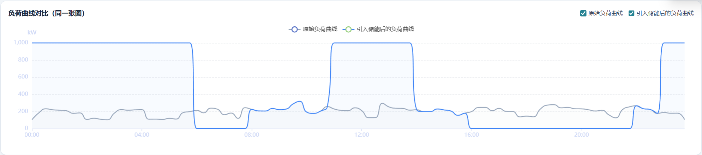

测试结果报表记录
profit_days，2024-11-18数据如下：
date	main_revenue	main_cost	main_profit	main_discharge_energy_kwh	main_charge_energy_kwh	main_profit_per_kwh	physics_revenue	physics_cost	physics_profit	physics_discharge_energy_kwh	physics_charge_energy_kwh	physics_profit_per_kwh	sample_revenue	sample_cost	sample_profit	sample_discharge_energy_kwh	sample_charge_energy_kwh	sample_profit_per_kwh
2024-11-18	833.040194	269.5412148	563.4989792	807.1	976.1388286	0.6981774	573.6048536	256.8315413	316.7733123	555.7432651	930.1109669	0.569999372	833.040194	269.5412148	563.4989792	807.1	976.1388286	0.6981774
power_step15，2024-11-18数据如下：
timestamp	load_kw	price	tier	date_str	year_month	op	limit_kw	p_batt_kw	e_in_physics_kwh	e_out_physics_kwh	e_in_sample_kwh	e_out_sample_kwh	p_grid_effect_physics_kw	p_grid_effect_sample_kw	cum_charge_grid_main	cum_discharge_grid_main	charge_target_grid_main	discharge_target_grid_main	load_with_storage_physics_kw	load_with_storage_sample_kw	p_grid_effect_main_kw	load_with_storage_main_kw
2024-11-18T00:00:00	104	0.27613	谷	2024-11-18	2024-11	充	1000	874.6203905	213.4377309	0	224	0	853.7509234	896	224	0	488.0694143	414.9	957.7509234	1000	896	1000
2024-11-18T00:15:00	184	0.27613	谷	2024-11-18	2024-11	充	1000	796.5292842	194.3807906	0	204	0	777.5231624	816	428	0	488.0694143	414.9	961.5231624	1000	816	1000
2024-11-18T00:30:00	231.2	0.27613	谷	2024-11-18	2024-11	充	1000	234.5443509	57.23696199	0	60.06941432	0	228.947848	240.2776573	488.0694143	0	488.0694143	414.9	460.147848	471.4776573	240.2776573	471.4776573
2024-11-18T00:45:00	220	0.27613	谷	2024-11-18	2024-11	充	1000	0	0	0	0	0	0	0	488.0694143	0	488.0694143	414.9	220	220	0	220
2024-11-18T01:00:00	214.4	0.27613	谷	2024-11-18	2024-11	充	1000	0	0	0	0	0	0	0	488.0694143	0	488.0694143	414.9	214.4	214.4	0	214.4
2024-11-18T01:15:00	208.8	0.27613	谷	2024-11-18	2024-11	充	1000	0	0	0	0	0	0	0	488.0694143	0	488.0694143	414.9	208.8	208.8	0	208.8
2024-11-18T01:30:00	178.4	0.27613	谷	2024-11-18	2024-11	充	1000	0	0	0	0	0	0	0	488.0694143	0	488.0694143	414.9	178.4	178.4	0	178.4
2024-11-18T01:45:00	183.2	0.27613	谷	2024-11-18	2024-11	充	1000	0	0	0	0	0	0	0	488.0694143	0	488.0694143	414.9	183.2	183.2	0	183.2
2024-11-18T02:00:00	106.4	0.27613	谷	2024-11-18	2024-11	充	1000	0	0	0	0	0	0	0	488.0694143	0	488.0694143	414.9	106.4	106.4	0	106.4
2024-11-18T02:15:00	120.8	0.27613	谷	2024-11-18	2024-11	充	1000	0	0	0	0	0	0	0	488.0694143	0	488.0694143	414.9	120.8	120.8	0	120.8
2024-11-18T02:30:00	108.8	0.27613	谷	2024-11-18	2024-11	充	1000	0	0	0	0	0	0	0	488.0694143	0	488.0694143	414.9	108.8	108.8	0	108.8
2024-11-18T02:45:00	103.2	0.27613	谷	2024-11-18	2024-11	充	1000	0	0	0	0	0	0	0	488.0694143	0	488.0694143	414.9	103.2	103.2	0	103.2
2024-11-18T03:00:00	180.8	0.27613	谷	2024-11-18	2024-11	充	1000	0	0	0	0	0	0	0	488.0694143	0	488.0694143	414.9	180.8	180.8	0	180.8
2024-11-18T03:15:00	221.6	0.27613	谷	2024-11-18	2024-11	充	1000	0	0	0	0	0	0	0	488.0694143	0	488.0694143	414.9	221.6	221.6	0	221.6
2024-11-18T03:30:00	214.4	0.27613	谷	2024-11-18	2024-11	充	1000	0	0	0	0	0	0	0	488.0694143	0	488.0694143	414.9	214.4	214.4	0	214.4
2024-11-18T03:45:00	219.2	0.27613	谷	2024-11-18	2024-11	充	1000	0	0	0	0	0	0	0	488.0694143	0	488.0694143	414.9	219.2	219.2	0	219.2
2024-11-18T04:00:00	221.6	0.27613	谷	2024-11-18	2024-11	充	1000	0	0	0	0	0	0	0	488.0694143	0	488.0694143	414.9	221.6	221.6	0	221.6
2024-11-18T04:15:00	109.6	0.27613	谷	2024-11-18	2024-11	充	1000	0	0	0	0	0	0	0	488.0694143	0	488.0694143	414.9	109.6	109.6	0	109.6
2024-11-18T04:30:00	110.4	0.27613	谷	2024-11-18	2024-11	充	1000	0	0	0	0	0	0	0	488.0694143	0	488.0694143	414.9	110.4	110.4	0	110.4
2024-11-18T04:45:00	106.4	0.27613	谷	2024-11-18	2024-11	充	1000	0	0	0	0	0	0	0	488.0694143	0	488.0694143	414.9	106.4	106.4	0	106.4
2024-11-18T05:00:00	120	0.27613	谷	2024-11-18	2024-11	充	1000	0	0	0	0	0	0	0	488.0694143	0	488.0694143	414.9	120	120	0	120
2024-11-18T05:15:00	111.2	0.27613	谷	2024-11-18	2024-11	充	1000	0	0	0	0	0	0	0	488.0694143	0	488.0694143	414.9	111.2	111.2	0	111.2
2024-11-18T05:30:00	186.4	0.27613	谷	2024-11-18	2024-11	充	1000	0	0	0	0	0	0	0	488.0694143	0	488.0694143	414.9	186.4	186.4	0	186.4
2024-11-18T05:45:00	198.4	0.27613	谷	2024-11-18	2024-11	充	1000	0	0	0	0	0	0	0	488.0694143	0	488.0694143	414.9	198.4	198.4	0	198.4
2024-11-18T06:00:00	212.8	1.03214	峰	2024-11-18	2024-11	放	1000	-176.58144	0	36.63181973	0	53.2	-146.5272789	-212.8	488.0694143	53.2	488.0694143	414.9	66.27272109	0	-212.8	0
2024-11-18T06:15:00	184	1.03214	峰	2024-11-18	2024-11	放	1000	-152.6832	0	31.67412984	0	46	-126.6965194	-184	488.0694143	99.2	488.0694143	414.9	57.30348064	0	-184	0
2024-11-18T06:30:00	238.4	1.03214	峰	2024-11-18	2024-11	放	1000	-197.82432	0	41.03865518	0	59.6	-164.1546207	-238.4	488.0694143	158.8	488.0694143	414.9	74.24537926	0	-238.4	0
2024-11-18T06:45:00	226.4	1.03214	峰	2024-11-18	2024-11	放	1000	-187.86672	0	38.97295106	0	56.6	-155.8918043	-226.4	488.0694143	215.4	488.0694143	414.9	70.50819574	0	-226.4	0
2024-11-18T07:00:00	162.4	1.03214	峰	2024-11-18	2024-11	放	1000	-134.75952	0	27.95586242	0	40.6	-111.8234497	-162.4	488.0694143	256	488.0694143	414.9	50.5765503	0	-162.4	0
2024-11-18T07:15:00	181.6	1.03214	峰	2024-11-18	2024-11	放	1000	-150.69168	0	31.26098902	0	45.4	-125.0439561	-181.6	488.0694143	301.4	488.0694143	414.9	56.55604394	0	-181.6	0
2024-11-18T07:30:00	119.2	1.03214	峰	2024-11-18	2024-11	放	1000	-98.91216	0	20.51932759	0	29.8	-82.07731037	-119.2	488.0694143	331.2	488.0694143	414.9	37.12268963	0	-119.2	0
2024-11-18T07:45:00	244	1.03214	峰	2024-11-18	2024-11	放	1000	-202.4712	0	42.00265044	0	61	-168.0106018	-244	488.0694143	392.2	488.0694143	414.9	75.98939824	0	-244	0
2024-11-18T08:00:00	224.8	0.62017	平	2024-11-18	2024-11	待机	1000	0	0	0	0	0	0	0					224.8	224.8	0	224.8
2024-11-18T08:15:00	206.4	0.62017	平	2024-11-18	2024-11	待机	1000	0	0	0	0	0	0	0					206.4	206.4	0	206.4
2024-11-18T08:30:00	205.6	0.62017	平	2024-11-18	2024-11	待机	1000	0	0	0	0	0	0	0					205.6	205.6	0	205.6
2024-11-18T08:45:00	235.2	0.62017	平	2024-11-18	2024-11	待机	1000	0	0	0	0	0	0	0					235.2	235.2	0	235.2
2024-11-18T09:00:00	220.8	0.62017	平	2024-11-18	2024-11	待机	1000	0	0	0	0	0	0	0					220.8	220.8	0	220.8
2024-11-18T09:15:00	228	0.62017	平	2024-11-18	2024-11	待机	1000	0	0	0	0	0	0	0					228	228	0	228
2024-11-18T09:30:00	287.2	0.62017	平	2024-11-18	2024-11	待机	1000	0	0	0	0	0	0	0					287.2	287.2	0	287.2
2024-11-18T09:45:00	318.4	0.62017	平	2024-11-18	2024-11	待机	1000	0	0	0	0	0	0	0					318.4	318.4	0	318.4
2024-11-18T10:00:00	192	0.62017	平	2024-11-18	2024-11	待机	1000	0	0	0	0	0	0	0					192	192	0	192
2024-11-18T10:15:00	177.6	0.62017	平	2024-11-18	2024-11	待机	1000	0	0	0	0	0	0	0					177.6	177.6	0	177.6
2024-11-18T10:30:00	204	0.62017	平	2024-11-18	2024-11	待机	1000	0	0	0	0	0	0	0					204	204	0	204
2024-11-18T10:45:00	256.8	0.62017	平	2024-11-18	2024-11	待机	1000	0	0	0	0	0	0	0					256.8	256.8	0	256.8
2024-11-18T11:00:00	228.8	0.27613	谷	2024-11-18	2024-11	充	1000	752.7982646	183.7089041	0	192.8	0	734.8356162	771.2	192.8	0	488.0694143	414.9	963.6356162	1000	771.2	1000
2024-11-18T11:15:00	212.8	0.27613	谷	2024-11-18	2024-11	充	1000	768.4164859	187.5202921	0	196.8	0	750.0811684	787.2	389.6	0	488.0694143	414.9	962.8811684	1000	787.2	1000
2024-11-18T11:30:00	208.8	0.27613	谷	2024-11-18	2024-11	充	1000	384.479275	93.82628728	0	98.46941432	0	375.3051491	393.8776573	488.0694143	0	488.0694143	414.9	584.1051491	602.6776573	393.8776573	602.6776573
2024-11-18T11:45:00	242.4	0.27613	谷	2024-11-18	2024-11	充	1000	0	0	0	0	0	0	0	488.0694143	0	488.0694143	414.9	242.4	242.4	0	242.4
2024-11-18T12:00:00	210.4	0.27613	谷	2024-11-18	2024-11	充	1000	0	0	0	0	0	0	0	488.0694143	0	488.0694143	414.9	210.4	210.4	0	210.4
2024-11-18T12:15:00	127.2	0.27613	谷	2024-11-18	2024-11	充	1000	0	0	0	0	0	0	0	488.0694143	0	488.0694143	414.9	127.2	127.2	0	127.2
2024-11-18T12:30:00	128	0.27613	谷	2024-11-18	2024-11	充	1000	0	0	0	0	0	0	0	488.0694143	0	488.0694143	414.9	128	128	0	128
2024-11-18T12:45:00	295.2	0.27613	谷	2024-11-18	2024-11	充	1000	0	0	0	0	0	0	0	488.0694143	0	488.0694143	414.9	295.2	295.2	0	295.2
2024-11-18T13:00:00	252	0.27613	谷	2024-11-18	2024-11	充	1000	0	0	0	0	0	0	0	488.0694143	0	488.0694143	414.9	252	252	0	252
2024-11-18T13:15:00	237.6	0.27613	谷	2024-11-18	2024-11	充	1000	0	0	0	0	0	0	0	488.0694143	0	488.0694143	414.9	237.6	237.6	0	237.6
2024-11-18T13:30:00	235.2	0.27613	谷	2024-11-18	2024-11	充	1000	0	0	0	0	0	0	0	488.0694143	0	488.0694143	414.9	235.2	235.2	0	235.2
2024-11-18T13:45:00	215.2	0.27613	谷	2024-11-18	2024-11	充	1000	0	0	0	0	0	0	0	488.0694143	0	488.0694143	414.9	215.2	215.2	0	215.2
2024-11-18T14:00:00	220	0.62017	平	2024-11-18	2024-11	待机	1000	0	0	0	0	0	0	0					220	220	0	220
2024-11-18T14:15:00	198.4	0.62017	平	2024-11-18	2024-11	待机	1000	0	0	0	0	0	0	0					198.4	198.4	0	198.4
2024-11-18T14:30:00	198.4	0.62017	平	2024-11-18	2024-11	待机	1000	0	0	0	0	0	0	0					198.4	198.4	0	198.4
2024-11-18T14:45:00	228.8	0.62017	平	2024-11-18	2024-11	待机	1000	0	0	0	0	0	0	0					228.8	228.8	0	228.8
2024-11-18T15:00:00	217.6	0.62017	平	2024-11-18	2024-11	待机	1000	0	0	0	0	0	0	0					217.6	217.6	0	217.6
2024-11-18T15:15:00	204.8	0.62017	平	2024-11-18	2024-11	待机	1000	0	0	0	0	0	0	0					204.8	204.8	0	204.8
2024-11-18T15:30:00	155.2	0.62017	平	2024-11-18	2024-11	待机	1000	0	0	0	0	0	0	0					155.2	155.2	0	155.2
2024-11-18T15:45:00	180	0.62017	平	2024-11-18	2024-11	待机	1000	0	0	0	0	0	0	0					180	180	0	180
2024-11-18T16:00:00	199.2	1.03214	峰	2024-11-18	2024-11	放	1000	-165.29616	0	34.29068839	0	49.8	-137.1627536	-199.2	488.0694143	49.8	488.0694143	414.9	62.03724643	0	-199.2	0
2024-11-18T16:15:00	246.4	1.03214	峰	2024-11-18	2024-11	放	1000	-204.46272	0	42.41579126	0	61.6	-169.6631651	-246.4	488.0694143	111.4	488.0694143	414.9	76.73683494	0	-246.4	0
2024-11-18T16:30:00	247.2	1.03214	峰	2024-11-18	2024-11	放	1000	-205.12656	0	42.55350487	0	61.8	-170.2140195	-247.2	488.0694143	173.2	488.0694143	414.9	76.98598051	0	-247.2	0
2024-11-18T16:45:00	208.8	1.03214	峰	2024-11-18	2024-11	放	1000	-173.26224	0	35.94325169	0	52.2	-143.7730068	-208.8	488.0694143	225.4	488.0694143	414.9	65.02699325	0	-208.8	0
2024-11-18T17:00:00	236	1.03214	峰	2024-11-18	2024-11	放	1000	-195.8328	0	40.62551436	0	59	-162.5020574	-236	488.0694143	284.4	488.0694143	414.9	73.49794256	0	-236	0
2024-11-18T17:15:00	201.6	1.03214	峰	2024-11-18	2024-11	放	1000	-167.28768	0	34.70382922	0	50.4	-138.8153169	-201.6	488.0694143	334.8	488.0694143	414.9	62.78468314	0	-201.6	0
2024-11-18T17:30:00	200	1.03214	峰	2024-11-18	2024-11	放	1000	-165.96	0	34.428402	0	50	-137.713608	-200	488.0694143	384.8	488.0694143	414.9	62.286392	0	-200	0
2024-11-18T17:45:00	136.8	1.03214	峰	2024-11-18	2024-11	放	1000	-99.90792	0	20.725898	0	30.1	-82.90359202	-120.4	488.0694143	414.9	488.0694143	414.9	53.89640798	16.4	-120.4	16.4
2024-11-18T18:00:00	145.6	1.03214	峰	2024-11-18	2024-11	放	1000	0	0	0	0	0	0	0	488.0694143	414.9	488.0694143	414.9	145.6	145.6	0	145.6
2024-11-18T18:15:00	137.6	1.03214	峰	2024-11-18	2024-11	放	1000	0	0	0	0	0	0	0	488.0694143	414.9	488.0694143	414.9	137.6	137.6	0	137.6
2024-11-18T18:30:00	228	1.03214	峰	2024-11-18	2024-11	放	1000	0	0	0	0	0	0	0	488.0694143	414.9	488.0694143	414.9	228	228	0	228
2024-11-18T18:45:00	273.6	1.03214	峰	2024-11-18	2024-11	放	1000	0	0	0	0	0	0	0	488.0694143	414.9	488.0694143	414.9	273.6	273.6	0	273.6
2024-11-18T19:00:00	279.2	1.03214	峰	2024-11-18	2024-11	放	1000	0	0	0	0	0	0	0	488.0694143	414.9	488.0694143	414.9	279.2	279.2	0	279.2
2024-11-18T19:15:00	242.4	1.03214	峰	2024-11-18	2024-11	放	1000	0	0	0	0	0	0	0	488.0694143	414.9	488.0694143	414.9	242.4	242.4	0	242.4
2024-11-18T19:30:00	247.2	1.03214	峰	2024-11-18	2024-11	放	1000	0	0	0	0	0	0	0	488.0694143	414.9	488.0694143	414.9	247.2	247.2	0	247.2
2024-11-18T19:45:00	232	1.03214	峰	2024-11-18	2024-11	放	1000	0	0	0	0	0	0	0	488.0694143	414.9	488.0694143	414.9	232	232	0	232
2024-11-18T20:00:00	230.4	1.03214	峰	2024-11-18	2024-11	放	1000	0	0	0	0	0	0	0	488.0694143	414.9	488.0694143	414.9	230.4	230.4	0	230.4
2024-11-18T20:15:00	220	1.03214	峰	2024-11-18	2024-11	放	1000	0	0	0	0	0	0	0	488.0694143	414.9	488.0694143	414.9	220	220	0	220
2024-11-18T20:30:00	205.6	1.03214	峰	2024-11-18	2024-11	放	1000	0	0	0	0	0	0	0	488.0694143	414.9	488.0694143	414.9	205.6	205.6	0	205.6
2024-11-18T20:45:00	213.6	1.03214	峰	2024-11-18	2024-11	放	1000	0	0	0	0	0	0	0	488.0694143	414.9	488.0694143	414.9	213.6	213.6	0	213.6
2024-11-18T21:00:00	159.2	1.03214	峰	2024-11-18	2024-11	放	1000	0	0	0	0	0	0	0	488.0694143	414.9	488.0694143	414.9	159.2	159.2	0	159.2
2024-11-18T21:15:00	125.6	1.03214	峰	2024-11-18	2024-11	放	1000	0	0	0	0	0	0	0	488.0694143	414.9	488.0694143	414.9	125.6	125.6	0	125.6
2024-11-18T21:30:00	224	1.03214	峰	2024-11-18	2024-11	放	1000	0	0	0	0	0	0	0	488.0694143	414.9	488.0694143	414.9	224	224	0	224
2024-11-18T21:45:00	254.4	1.03214	峰	2024-11-18	2024-11	放	1000	0	0	0	0	0	0	0	488.0694143	414.9	488.0694143	414.9	254.4	254.4	0	254.4
2024-11-18T22:00:00	266.4	0.62017	平	2024-11-18	2024-11	待机	1000	0	0	0	0	0	0	0					266.4	266.4	0	266.4
2024-11-18T22:15:00	232.8	0.62017	平	2024-11-18	2024-11	待机	1000	0	0	0	0	0	0	0					232.8	232.8	0	232.8
2024-11-18T22:30:00	223.2	0.62017	平	2024-11-18	2024-11	待机	1000	0	0	0	0	0	0	0					223.2	223.2	0	223.2
2024-11-18T22:45:00	177.6	0.62017	平	2024-11-18	2024-11	待机	1000	0	0	0	0	0	0	0					177.6	177.6	0	177.6
2024-11-18T23:00:00	187.2	0.27613	谷	2024-11-18	2024-11	充	1000	0	0	0	0	0	0	0	488.0694143	392.2	488.0694143	414.9	187.2	187.2	0	187.2
2024-11-18T23:15:00	179.2	0.27613	谷	2024-11-18	2024-11	充	1000	0	0	0	0	0	0	0	488.0694143	392.2	488.0694143	414.9	179.2	179.2	0	179.2
2024-11-18T23:30:00	180	0.27613	谷	2024-11-18	2024-11	充	1000	0	0	0	0	0	0	0	488.0694143	392.2	488.0694143	414.9	180	180	0	180
2024-11-18T23:45:00	104.8	0.27613	谷	2024-11-18	2024-11	充	1000	0	0	0	0	0	0	0	488.0694143	392.2	488.0694143	414.9	104.8	104.8	0	104.8
---
Window_debug数据
date	window	kind	hour_list	points	hours	limit_kw	avg_load_kw	allow_kw	base_kwh	e_grid_kwh	full_ratio	e_grid_kwh_physics	full_ratio_physics	e_grid_kwh_sample	full_ratio_sample	base_kwh_step15	e_grid_kwh_physics_step15	full_ratio_physics_step15	e_grid_kwh_sample_step15	full_ratio_sample_step15
2024-11-18	c1	charge	0,1,2,3,4,5,23	28	7	1000	164.8	835.2	5846.4	5989.312	1	5706.898048	1	5989.312	1	5846.4	5706.898048	1	5989.312	1
2024-11-18	c1	discharge	6,7	8	2	1000	196.1	196.1	392.2	472.6440106	0.945288021	325.44756	0.65089512	472.6440106	0.945288021	392.2	325.44756	0.65089512	472.6440106	0.945288021
2024-11-18	c2	charge	11,12,13	12	3	1000	216.1333333	783.8666667	2351.6	2409.083556	1	2295.488069	1	2409.083556	1	2351.6	2295.488069	1	2409.083556	1
2024-11-18	c2	discharge	16,17,18,19,20,21	24	6	1000	212.2666667	212.2666667	1273.6	1534.827669	1	1056.83328	1	1534.827669	1	1273.6	1056.83328	1	1534.827669	1
